# Interview Scheduler
—time is a precious commodity for Lighthouse Labbers.  Optimize your time with our scheduler.

*Better match your time to LHL tech mentor availabilities*

## Final Product

Key features:
1) Live updates with a WebSocket.server and all connected users see the update in their browser.
  *When you make your appointment with us, you know it is not double booked by accident.*
2) A weekly view of appointment availabilities with daily mentors available.
3) Utilize React reducers to efficiently manage multiple states to simulate complex API queries.

### Mobile View

#### Loading Page Waiting for Server Data
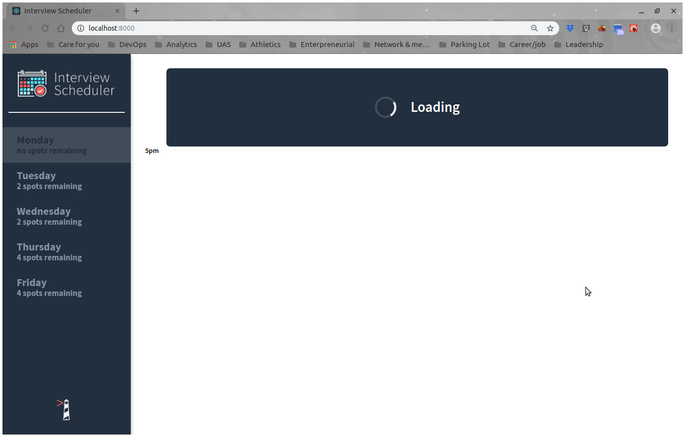

#### Button Visuals On Different States
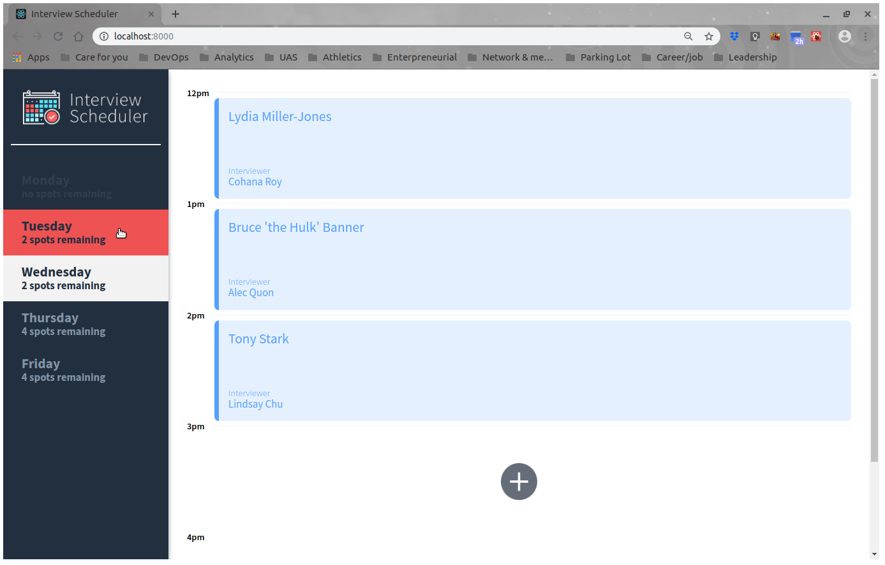

#### Existing Appointment's Visuals On Different States
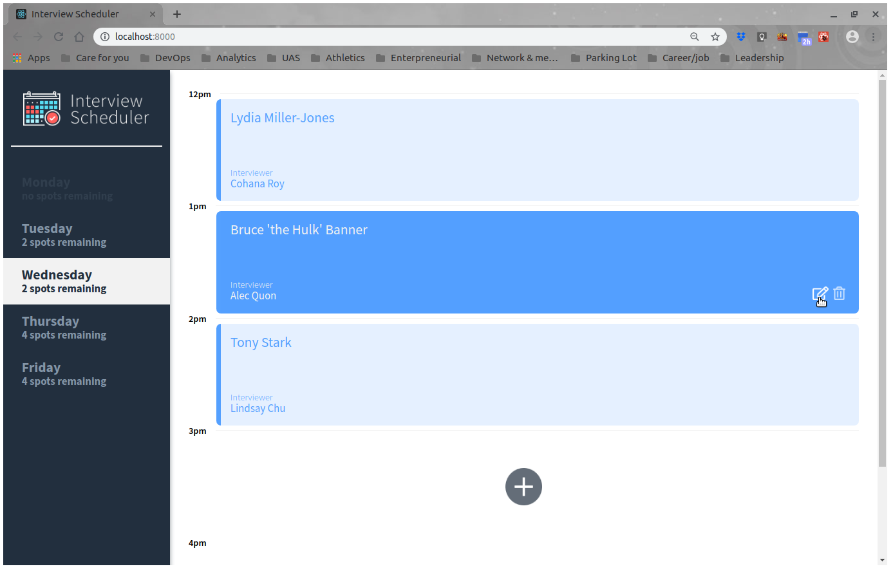

#### Startup Screen
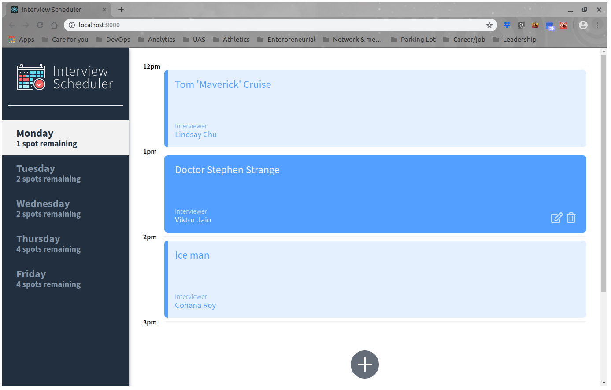

#### Loading Page Waiting for Server Data
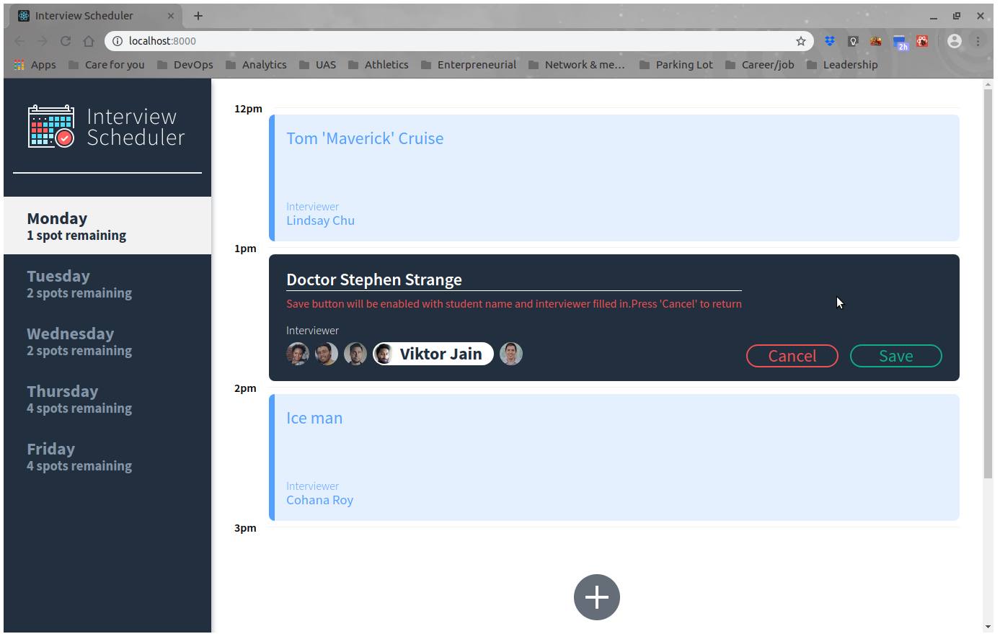

#### Form Screen To Edit An Existing Appointment
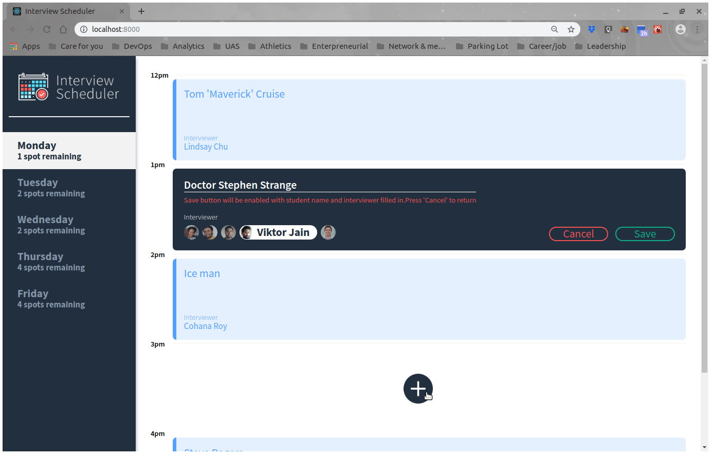
0
#### Form To Sign-up For An Appointment
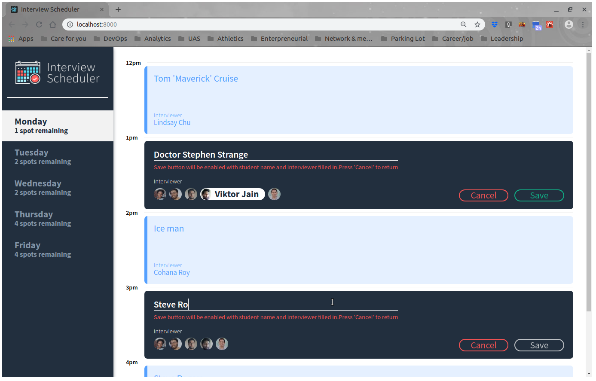

#### Status Page Awaiting For Server Respond
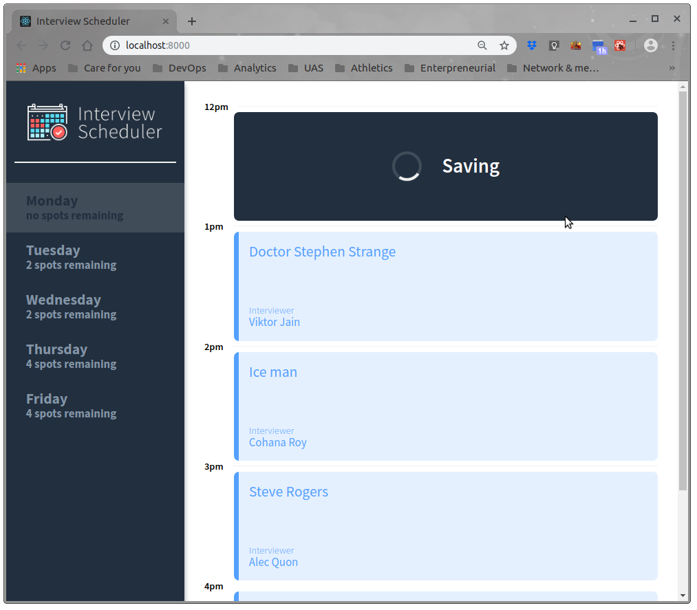

#### Server Error Editing An Appointment
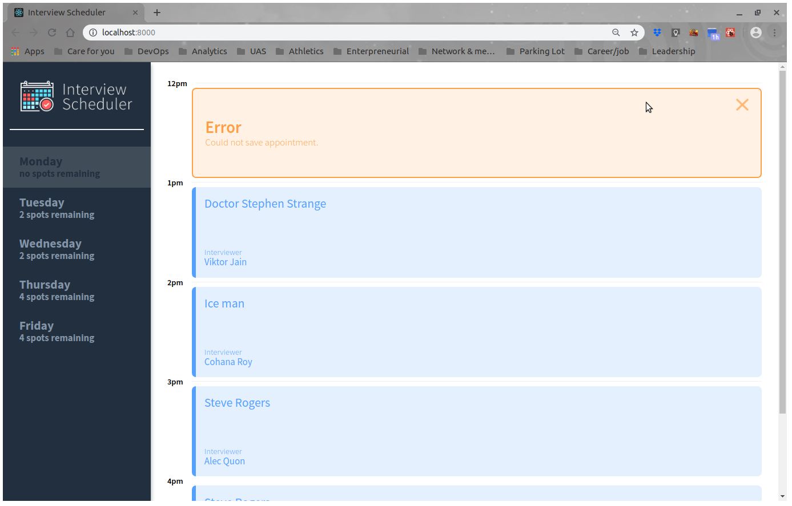

#### Awaiting For Server Response on Deleting An Appointment
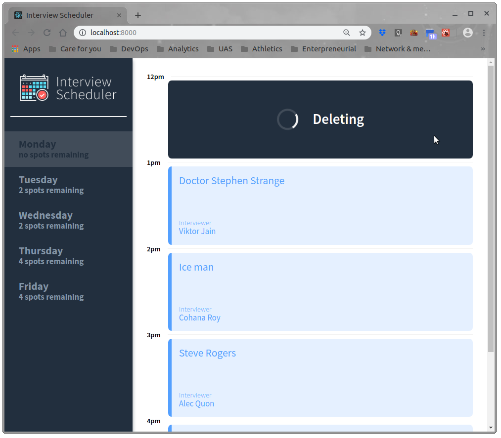

#### Server Error Deleting An Appointment
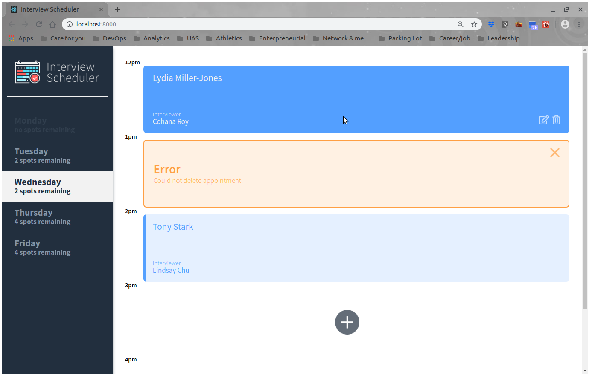

## Built With

* [React](https://reactjs.org/) - Library building user interfaces for client application
* [Webpack](https://webpack.js.org/), [Babel](https://babeljs.io/) - Tools for development server
* [Axios](https://github.com/axios/axios), [WebSockets](https://developer.mozilla.org/en-US/docs/Web/API/WebSockets_API) - Tools to communicate with server
* [Storybook](https://storybook.js.org/), [Jest](https://jestjs.io/en/) - Unit and Integration Testing
* [Cypress](https://www.cypress.io/features/) - End-to-End Testing

## Project Setup

### Dependencies

- axios
- babel-loader *devDependencies*
- classnames
- node-sass *devDependencies*
- react
- react-dom
- react-scripts
- nodemon *devDependencies*

### Installation

1. Clone the repo.

2. Create a .env.development file and update the .gitignore.

3. Update the .env file with the postgres database information. For example:
```
REACT_APP_WEBSOCKET_URL=ws://localhost:8001
PORT=8000
CHOKIDAR_USEPOLLING=false
```

4. Follow the migration and seed setup instructions on [Lighthouse Lab API server](https://github.com/lighthouse-labs/scheduler-api)

5. Install node dependencies:
```
npm i
```

6. Add the proxy to the API server to the package.json:
```
"proxy": "http://localhost:8001",
```

7. Start the API server in a Guest terminal (vagrant machine for Lighthouse Labbers):
*Note: Refer to the package.json of the API for scripts*
```sh
npm start
```

8. Start up the Host localhost server and a new browser window will pop-up. The default port is 8080.
*Note: nodemon is used, so you should not have to restart your server*
```sh
npm start
```

## Running The Tests


### Installation Of Testing Servers

* Running Jest Test Framework

```sh
npm test
```

* Running Storybook Visual Testbed

```sh
npm run storybook
```

* Running Cypress End-to-End test

```sh
npm run cypress
```

### Break Down Into End To End Tests

The End-to-End Testing activity tests the three main functionalities:

* "should book an interview"
* "should edit an interview"
* "should cancel an interview"

#### Booking

1. Clicks on the "Add" button to an available appointment
2. Student enter their name and choose an interviewer
3. Clicks the save button

Test includes:
* Input check to ensure both student's name and interviewer were filled in.
* Checks successful booking (i.e. PUT) using should and find function (i.e. .should.expect) the apppintment's student name exists.
* Check the available spot(s) reduced by 1 to check the spots remaining functionality worked.

#### Editing

1. Clicks the edit button for an existing appointment
2. Changes the student's name and select a different interviewer
3. Clicks the save button

Test includes:
* Input check to ensure both student's name and interviewer remains filled in.
* Checks successful update (i.e. PUT) by should and find (i.e. .should.expect) the apppintment's new student name exists.
* Check the available spot(s) were not reduced by 1 to check the spots remaining functionality behaved appropriately.

#### Canceling
Note: The API server may need to be reset after the above tests.  This is needed to ensure the script does not cancel an interview that was not available in the default test data.

1. Clicks the delete button for an existing appointment
2. Clicks the confirm button

Test includes:
* Check the confirmation page and button appeared after clicking the delete button
* Checks successful deletion (i.e. DELETE) using should and find (i.e. .should.expect) to ensure the previous student's name no longer exists.
* Check the available spot(s) were increased by 1 to ensure the spots remaining functionality behaved appropriately.

#### Examples
Check the abscence of previous student's name
```
cy.contains(".appointment__card--show", "Steve 'Captain America' Rogers")
  .should("not.exist");
```

Check available spots
```
cy.contains("[data-testid=day]", "Monday")
  .find("h3")
  .should($h3 => expect($h3).to.contain("no spots remaining"));
```

## Contributing

There is currently no process for submitting pull requests to this student project.

## Versioning

* [SemVer](http://semver.org/) for versioning: version 1.0.0.

## Author(s)

* [**Michael Chui**](https://github.com/mikel-k-khui) - *Initial work*

## License

This project is licensed under the MIT License - see the [LICENSE.md](LICENSE.md) file for details

